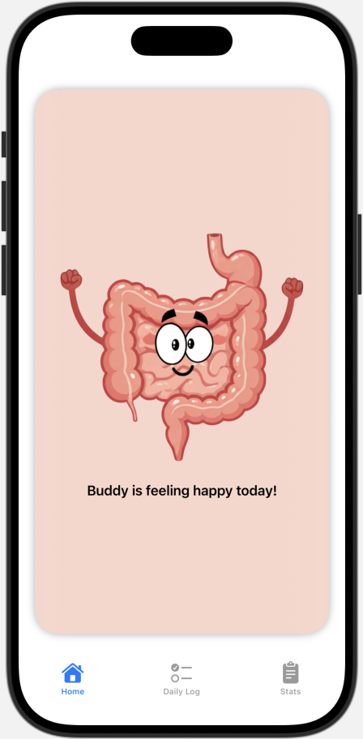
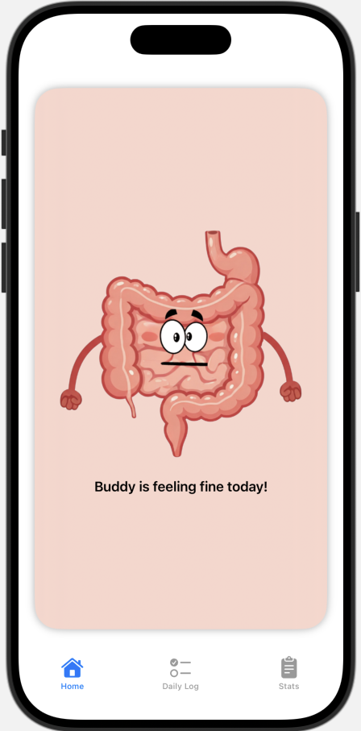
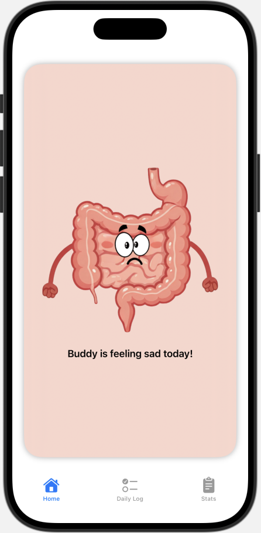
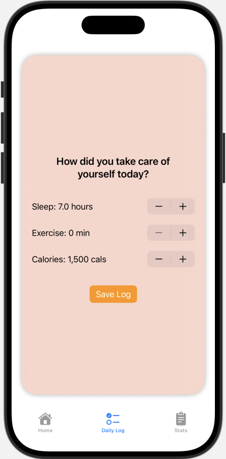
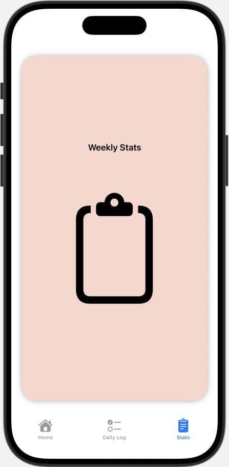

# IBD Buddy App

# App Description
This app is a simplified version of the IBD Buddy self-case app, implementing a 3-tab tabView. The Home tab features the Buddy Avatar, whose emotions and expressions change based on the information the user logs in the Daily Log tab. The Stats tab will soon be updated to display the user's patterns and progress, once the app is advanced to the level of saving the user's data.

# Features
- Avatar that displays 3 emotions: happy, fine, sad based on user log
- Daily Log that allows user to log how many hours they slept, hours they exercised, and calories they consumed that day
- Stats tab that (will) display user progress

# Project Structure
## ContentView - comprises all views into the complete app
- implements a TabView to create adjacent tabs at the bottom of on the screen
- features 3 tabs: 'Home', 'Daily Log', and 'Stats'

## HomeView - displays Avatar on Home Page
- uses spaced VStack to contain ZStack which holds background shape and foreground image
- ZStack contains rounded rectangle, which sits behind Avatar image and text
- before displaying, checks user's latest daily log and sets avatar's mood accordingly

## LogView - form for user to fill out daily log
- stacks two rectangles, top displays date, second is background for log form
- uses 3 steppers to enable user to manually increment or decrement log values
- 'Save Log' button saves info as a new DailyLog and encodes to the latest log data

### Daily Log - struct to contain user's entered info and calculate mood
Implemented by LogView
Variables:
- sleepHours (Double)
- exerciseMins (Int)
- calories (Int)
- mood -> calculated through a score of 1, 2, or 3 based on the above criteria

##DataView - displays user Stats
TBD

# Screenshots

## Author
Adina Gross
